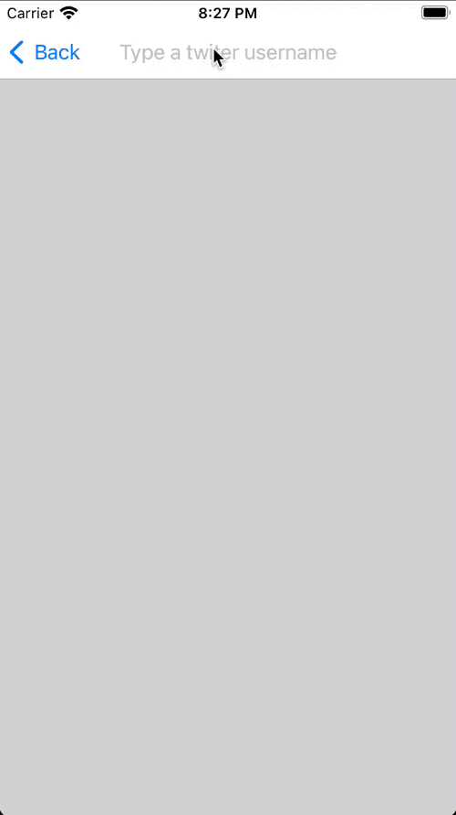

<p align="center">


[](https://developer.apple.com/swift/)
[](./LICENSE)
[](https://img.shields.io/cocoapods/v/AOperation.svg)
[](https://ssamadgh.github.io/AOperation)
[](https://codebeat.co/projects/github-com-ssamadgh-aoperation-master)
[](https://twitter.com/ssamadgh)
[](https://www.linkedin.com/in/ssamadgh)

 A wrapper on Operation and OperationQueue classes which gives some more power to using them.

* **[Features](#features)**
* **[Demo](#demo)**
* **[Installation](#installation)**
* **[Usage](#usage)**
* **[Credits](#credits)**
* **[License](#license)**


## Features
- [x] Supports Declarative Syntax
- [x] Can be used with **[Combine](https://developer.apple.com/documentation/combine)**
- [x] Easy to use
- [x] Helps to have a better short and modular codes
- [x] Prevents of repeating codes by using reusable operaions and conditions
- [x] Very flexible
- [x] Fully adaptable to any programming style and architecture

## Demo

### TweetSeeker
The first demo is about a simple app that fetches tweets of a given username.

<p align="center">

The first time user opens the app and types a username, a view controller presents that asks for registerion.
You should notice that this registeration view controller is not added as a view controller flow to the app, but it's added as a condition to the each operation that needs authorization for executiong its task.
The condition will be evaluate at the time operation adds to queue and being ready to execute. The flow of condition evaluation is shown below.

<p align="center">

Each condition can have a dependent operation which will be added to the enqueue operation as dependency. The dependent operation executes and finishes before condition evaluation.
For this app **AuthorizationCondition** has **CheckAuthorizationOperation** as dependentOperation.
CheckAuthorizationOperation, checks if authorization key is not available presents **RegisterationViewController** to ask user for authorization. When authorization did complete operation finishes. Then condition evaluates if authorization key is now available or not. If it is available condition evaluation will be succeed otherwise it fails. 

<p align="center">

So as soon as the app gets authorized, user can search for tweets of entered username.

<p align="center">


Codes of fetching tweets and updating view is written in two ways

#### Using just AOperation

```swift

		guard let username = sender.text, !username.isEmpty else { return }
		
		// We used AOperation to handle process of
		// fetching tweets
		
		// If there is an enqueued fetchOperation we cancel it
		// and creating a new fetch operation with the given new username
		fetchOperation?.cancel()
		
		// We set a delay before fetching tweets to make sure
		// the given username is the one user wants to fetch
		// tweets for.
		fetchOperation =
		DelayOperation<Void>(1)
			.deliver(to: MapOperationBlock<Void, String> { _, finish in
				finish(.success(username))
			})
			// Do not forget to use [weak self] if you referenced to self or any other reference type instance objects.
			.deliver(to: FetchUserTimeLineOperation()).didFinish { [weak self] (result) in
				guard let `self` = self else { return }
			switch result {
			case .success(let tweets):
				self.searchTextField.textColor = tweets.count > 0 ? #colorLiteral(red: 0, green: 0.4784313725, blue: 1, alpha: 1) : .black
				self.tweets = tweets

			case .failure:
				self.tweets = []
				self.searchTextField.textColor = .black
				return
			}
		}
		// Always call this method at the end of a chain to enqueue chain of operations
		.add(to: queue)

```

#### Using AOperation with Combine

```swift
		// Here we used a combination of two AOperation and Combine
		// frameworks to fetching tweets
		// Notice to shortness and readablity of this bunch of codes
		cancellable =
			$searchedText
			.delay(for: 1, scheduler: RunLoop.main)
			.compactMap({ (text) -> String? in
				return text?.replacingOccurrences(of: " ", with: "")
			})
			.filter({!$0.isEmpty})
			.removeDuplicates()
			.deliver(to: FetchUserTimeLineOperation(), on: queue)
			.catch({ _ in Just([])})
			.assign(to: \.tweets, on: self)

```
Review and compare above codes to see the power of AOperation specially when used with combine. **[ReadMore](./Examples/TweetSeeker/TweetSeeker/README.md)**


## Earthquakes
The second demo is a simple app that shows recent earthquakes in the world.

As the user opens the app, the app checks coredata model availability and if it is available, fetches coredata datas and updates UI, otherwise it shows a blank list of view.
By pulling to refresh tableviewController the app fetches new earthquakes data from internet and stores them into core data model and updates UI again.
If you tap on each earthquake row, you push into a new view controller that shows some more details about earthquake.
For example it gets access to user location to show distance of earthquake to user place. also you can share earthquake info in this view
All of these works is done with using AOperation. **[ReadMore](./Examples/Earthquakes/Earthquakes/README.md)**


<p align="center">


## Installation

### CocoaPods

[CocoaPods](https://cocoapods.org) is a dependency manager for Cocoa projects. You can install it with the following command:

```bash
$ gem install cocoapods
```

To integrate AOperation into your Xcode project using CocoaPods, specify it in your `Podfile`:

```ruby

platform :ios, '10.0'
use_frameworks!

target '<Your Target Name>' do

    pod 'AOperation', '~> 2.0.0'
    
end

```

### Swift Package Manager

The [Swift Package Manager](https://swift.org/package-manager/) is a tool for automating the distribution of Swift code and is integrated into the `swift` compiler. It is in early development, but Alamofire does support its use on supported platforms.

Once you have your Swift package set up, adding Alamofire as a dependency is as easy as adding it to the `dependencies` value of your `Package.swift`.

```swift
dependencies: [
    .package(url: "https://github.com/ssamadgh/AOperation.git", .upToNextMajor(from: "2.0.0"))
]
```

### Manually

If you prefer not to use any of the aforementioned dependency managers, you can integrate AOperation into your project manually.

#### Embedded Framework

- Open up Terminal, `cd` into your top-level project directory, and run the following command "if" your project is not initialized as a git repository:

  ```bash
  $ git init
  ```

- Add AOperation as a git [submodule](https://git-scm.com/docs/git-submodule) by running the following command:

  ```bash
  $ git submodule add https://github.com/ssamadgh/AOperation.git
  ```

- Open the new `AOperation ` folder, and drag the `AOperation.xcodeproj` into the Project Navigator of your application's Xcode project.

    > It should appear nested underneath your application's blue project icon. Whether it is above or below all the other Xcode groups does not matter.

- Select the `AOperation.xcodeproj` in the Project Navigator and verify the deployment target matches that of your application target.
- Next, select your application project in the Project Navigator (blue project icon) to navigate to the target configuration window and select the application target under the "Targets" heading in the sidebar.
- In the tab bar at the top of that window, open the "General" panel.
- Click on the `+` button under the "Embedded Binaries" section.
- You will see two different `AOperation.xcodeproj` folders each with a `AOperation.framework` nested inside a `Products` folder.

    > It does not matter which `Products` folder you choose from.

- Select the `AOperation.framework`.


- And that's it!

  > The `AOperation.framework` is automagically added as a target dependency, linked framework and embedded framework in a copy files build phase which is all you need to build on the simulator and a device.
  
## Usage

Use **[CheatSheet](./Usage/CheatSheet.md)** to have a fast review and training on AOperation main features.
Otherwise to have a deep understanding of AOperation use below list:

* [Basics](./Usage/Basics.md)
* [Declarative Programming with AOperation](./Usage/Declarative-operation.md)
* [Deliver result to another operation](./Usage/Deliver-to-operation.md)
* [Using AOperation with Combine](./Usage/AOperation-with-Combine.md)
* [Retrying an operation if it fails](./Usage/Retrying-an-operation-if-it-fails.md)
* [Some ready operations to use in your project](./Usage/Ready-to-use-operations.md)
* [Some ready conditions to use in your project](./Usage/Ready-to-use-conditions.md)
* [Some ready observers to use in your project](./Usage/Ready-to-use-observers.md)


## Credits

AOperation is owned and maintained by the [Seyed Samad Gholamzadeh](http://ssamadgh@gmail.com). You can follow me on Twitter at [@ssamadgh](https://twitter.com/ssamadgh) for project updates and releases.

## License

AOperation is released under the MIT license. [See LICENSE](./LICENSE) for details.
